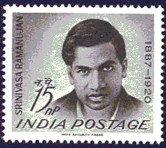
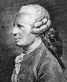

===========================================
代数学の基本定理
===========================================

有限個の係数や未知数を『 :math:`+,-,\times , \div , \sqrt{}` 』の５つの演算だけを組み合わせて作った式を *代数式* と呼びます(それに対して、 :math:`e^{x}` や :math:`\log x` の入っている式を *超越式* と呼びます)。 

未知数が代数式の形で表される方程式を *代数方程式* と呼びます。これは整理すれば、既にみなさんのよく知っている次の形の方程式になります。

.. math:: 
   a_{0}x^{n}+a_{1}x^{n-1}+...+a_{n-1}x+a_{n}=0

未知数 :math:`x` の一番大きな指数を、この方程式の *次数* と呼びます。この例では :math:`n` です。また、次数の一番大きな変数の項の係数(この例では :math:`a_{0}` )を、 *主係数* と呼びます。

代数学の基本定理
------------------------------------------------------
代数方程式の解について、次の重要な定理が知られています。とてもとても重要なので『代数学の基本定理』と呼ばれています。

.. admonition:: theorem

  n次方程式は、複素数の中にn個の解を持ちます。
	
	

証明は難しいので、ここでは省略して結果だけを覚えることにします。『複素数の中に』という、少し分かりにくい表現を使いましたが、これは、常に複素解を持つという意味ではありません。実数は複素数の特別な場合(虚部が零)だと考えられますし、有理数は実数の特別な場合です。もしも方程式が実数解や有理数解を持つとしても、それも複素数の特別な場合だと考えるのです。『解の最大の範囲として、複素数まで考えますよ』という意味です。

重要なのは解の個数の方です。例えば :math:`x^{2}=2` は有理数の範囲では解を持ちませんが、実数にまで探す範囲を広げれば :math:`x=\pm \sqrt{2}` という解を持ちます。同様に :math:`x^{2}=-1` も実数の範囲には解を持ちませんが、複素数にまで範囲を広げれば :math:`x=\pm i` という解を持ちます。このように *一般に方程式の解の個数は、解を探す数の範囲によって異なる* ものなのです。

代数学の基本定理は **複素数の範囲にまで解を探す範囲を広げれば、n次方程式には必ずn個の解がみつかる** ことを保証してくれる定理です。

解が存在することと、解けること
------------------------------------------------------
代数学の基本定理により、 :math:`n` 次方程式には :math:`n` 個の解があることが分かりましたが、どうやってその解を得るのかはまた別の問題です。　

代数方程式が与えられたとき、解を求める方法には実は色々あります。例えばコンピューターで方程式を解くときに使う方法は、近似的な解を求めておいて、その精度をどんどん良くしていくという近似解法です。数値計算、数値解析といった分野では、こうした解法を研究しています。

『なんとなく答えを思いついちゃった！』という神がかり的解法も、解法の一つと呼べるかも知れません。(試験の問題では、何となく答えが予想できる場合がありますね。)方程式の解とは違う話ですが、インドの超天才的数学者ラマヌジャン( :math:`\text{Srinivasa Aiyangar Ramanujan (1887-1920)}` )は、天啓により、次のような :math:`\pi = 3.14159265358979...` の近似式を大量に思いつきました。

.. math::
  \root 4\of {\frac{2143}{22}} =3.14159265258...

.. math::
  \frac{1}{2\sqrt{2}}\cdot \frac{99^{2}}{1103}=3.141592730...

.. math::
  \frac{63}{25}\cdot \frac{17+15 \sqrt{5}}{7+15 \sqrt{5}}=3.14159265380...

ラマヌジャンはインドの片田舎に生まれましたが、少年時代に三次方程式や四次方程式の解法を全く自力で思いつき、また多くの新しい公式や定理をナマギーリ女神の啓示によって思いつきました。のちにハーディー( :math:`\text{Godfrey Harold Hardy (1877-1947)}` )の助力でケンブリッジ大学に来てからも、朝起きると何となく新しい定理を思いついていて、それをハーディーが一生懸命証明する、という毎日だったそうです。ラマヌジャンの頭の中がどうなっていたのか、それは神秘です。英国の冬の寒さや不規則な生活がたたり、ラマヌジャンは早くして亡くなってしまいましたが、その定理の多くは普通の人が思いつかないような飛躍した内容を含み(これらの定理が正しいことは、多くの数学者がラマヌジャンの死後長い時間をかけて証明しました)、数論、解析、超幾何級数論、楕円関数論などに大きな貢献をしました(さらに詳しくは WikiPedia_ や こちら_ を参照下さい)。

	(インドの生んだ伝説的天才・ラマヌジャン)

方程式の解法から完全に話が逸れました。閑話休題。このあと代数分野では、『代数方程式を解く』ことが主要な話題になりますが、そこで使う *代数的解法* とは、『加・減・乗・除・開法』の５つの操作を有限回繰り返すことだけによって代数方程式の解を得る解法を指すこととします。開法とは、 :math:`n` 乗根を求める操作のことです。代数学で「ある方程式が代数的に解ける」と言えば、代数的解法によって解が得られるという意味です。

.. [*] 『有限回の操作で』という部分が非常に重要です。もしも無限回の操作を認めると、無限級数を使って :math:`\pi` や :math:`e` も表せます。しかし、これらの数は超越数と言って、決して代数方程式の解としては表せないことが分かっています。(証明は簡単ではありません。)

三次方程式や四次方程式は、大昔から解けないと思われてきましたが、 三次方程式の解の公式_ で紹介するように、代数的に解くことが出来ます。また、五次以上の代数方程式は代数的には解けないことが知られています。物理のかぎしっぽの代数学分野では、『五次以上の方程式は代数的に解けない』ことを理解することを目標に、ガロア理論と呼ばれる理論を勉強する予定ですから、ここではあまり深入りしません。　

『 *解があることと、解けることは別である* 』ことを覚えておいて下さい。

.. [*] 『代数学の基本定理』によって解の存在が保証されているにも関わらず、方程式が解けないなんて、五次以上の代数方程式、なんとも歯痒い奴らです。ただし、楕円関数論という理論を使うと五次方程式も解けるそうです。本当に方程式の解は解き方次第なんですね。

歴史
-----------------------------------------------------
方程式にいったい解があるのか無いのか、という問題は、古代バビロニアで代数方程式の研究が始まって以来の問題でした。この問題は本質的に『解をどの範囲に探すか』によります。例えば、前節の繰り返しになりますが、 :math:`x^{2}+1=0` は有理数や実数の範囲には解を持ちませんが、複素数まで含めれば :math:`x=\pm i` という解を持ちます。解を持たないと思われた方程式も、解を探す範囲を広げれば解が見つかるものなのです。数の概念は『自然数→整数→有理数→実数→複素数』と、数学の歴史とともに拡張されてきましたが、方程式の解の問題を定性的にきちんと扱うには、複素数の概念が固まり、どの範囲に解を探しているのかを明示的に認識できるようになる必要がありました。数にも色々な種類があることや、数の包含関係がきちんと認識されたのはそう昔のことではなく、この定理が登場したのも代数学の歴史の中では意外と最近のことです。

最初に代数学の基本定理を述べたのはダランベール( :math:`\text{Jean-le-Rond D'Alembert (1717-1783)}` )で、 :math:`1746` 年のことでした。ダランベールの証明は不完全なもので、完全な証明は :math:`1799` 年にガウス( :math:`\text{Karl Friedrich Gauss (1777-1855)}` )によって与えられました。ガウスはわずかに :math:`22` 才で、この証明が大学の学位論文になりました。この定理の証明には他にも数多くの方法があり、ガウス自身も :math:`4` 通りもの証明を示しています。

	(物理・数学・哲学・文学に万能の才能を見せた百科全書派のダランベール)

代数学の基本定理の証明には、もう少し難しい代数学の知識のほかに、複素積分が必要ですので、いずれそれらの記事が揃ったときにまた証明を示したいと思います。

.. _三次方程式の解の公式: 
.. _WikiPedia: http://ja.wikipedia.org/wiki/%E3%82%B7%E3%83%A5%E3%83%AA%E3%83%8B%E3%83%B4%E3%82%A1%E3%83%BC%E3%82%B5%E3%83%BB%E3%83%A9%E3%83%9E%E3%83%8C%E3%82%B8%E3%83%A3%E3%83%B3
.. _こちら: http://www.aa.alpha-net.ne.jp/t2366/%E3%81%99%E3%81%B9%E3%81%A6%E3%83%8A%E3%83%9E%E3%82%AE%E3%83%BC%E3%83%AA%E5%A5%B3%E7%A5%9E%E3%81%AE%E3%81%8A%E3%81%8B%E3%81%92%E3%81%AA%E3%82%93%E3%81%A0.htm
