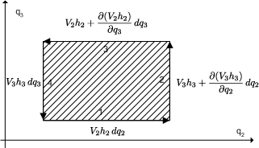

==========================
色々な座標系
==========================

物理学で座標系を考えることはとても大事です。
まず、座標について勉強するとどんな世界が見えてくるのかについて軽く触れます。
その後、具体的に色々な座標系を考える準備として、座標変換の際に出てくる計量因子という量と、
デカルト座標系以外での微分演算子(grad, div, curl等)がどうなるのかを見てみることにしましょう。

座標から見えてくること
--------------------------

物理の計算では、デカルト座標系以外の座標系が威力を発揮する場面がよくあります。
適切な座標変換をほどこすと、方程式が簡単な形になって問題の見通しが良くなることもありますし、
複雑な微分方程式が変数分離形に帰着して解けるようになることもあるのです
（物理学では、微分方程式を変数分離形に帰着させることが座標変換の目標であることがとても多いのです。
このことは特に強調しておきます）。

逆に、座標変換を考えることは、座標変換によっても変化しない幾何学的な性質を
考察することにも発展することでしょう。座標変換に対して不変な性質は、
解析力学、微分形式の理論、微分幾何学などを勉強するときにとても重要になります。

物理学でよく使われるベッセル関数、ルジャンドル関数などの特殊関数の多くは、
ある座標系と密接な関係を持っていますので、
色々な座標系を勉強してからそうした特殊関数の勉強をした方が意味が分かりやすいということもあります。
なんだか座標変換の先には難しい世界が広がっていそうな感じですね。

計量因子
--------------------------

デカルト座標系 :math:`(x_{1},x_{2},x_{3})` と、ある新しい座標系 :math:`(q_{1},q_{2},q_{3})` の
関係は一般に次のように表すことができます。お互い何か関数になっているということです。

.. math::
   x_{i}=x_{i}(q_{1},q_{2},q_{3})

.. math::
   q_{i}=q_{i}(x_{1},x_{2},x_{3})

ここから :math:`(x_{1},x_{2},x_{3})` の全微分は式(1)のように表されます。

.. math::
   \displaystyle dx_{i}={\partial x_{i}\over \partial q_{1}}
   dq_{1}+{\partial x_{i}\over \partial q_{2}}
   dq_{2}+{\partial x_{i}\over \partial q_{3}}
   dq_{3}
   \tag{1}

一方、空間上の微小な二点間の距離 :math:`ds` は次のように表現できます。

.. math::
   ds^{2}&=dx_{1}^{2}+dx_{2}^{2}+dx_{3}^{2}\\
   &=(h_{11}dq_{1})^{2}+(h_{22}dq_{2})^{2}+(h_{33}dq_{3})^{2}+h_{12}^{2}dq_{1}dq_{2}+h_{23}^{2}dq_{3}dq_{3}+h_{31}^{2}dq_{3}dq_{1}\tag{2}   

ここで :math:`h` という量がいきなり出てきましたが、これは計量因子と呼ばれる量です。
計量因子とは、二つの座標系 :math:`(x_{1},x_{2},x_{3})` , :math:`(q_{1},q_{2},q_{3})` の間に式(2)
が成り立つように無理矢理考えだされた量だと言っても良いでしょう。
これは定義ですから、あまり式(2)で悩まないで下さい。

一般に :math:`(q_{1},q_{2},q_{3})` は必ずしも長さの次元を持つわけではありませんが（例えば角度）、
計量因子を掛けた量 :math:`hdq_{i}` は必ず長さの次元になることに注意しましょう。
計量因子とはそのような次元を持った量なのです。

式(1)を二乗して式(2)に代入すると一般に次式を得ます。これが計量因子の数学的正体です。

.. math::
   \displaystyle h_{ij}^{2}={\partial x_{1}\over \partial q_{i}}
   {\partial x_{1}\over \partial q_{j}}
   +{\partial x_{2}\over \partial q_{i}}
   {\partial x_{2}\over \partial q_{j}}
   +{\partial x_{3}\over \partial q_{i}}
   {\partial x_{3}\over \partial q_{j}}

ヤコビアンと計量因子
--------------------------

計量因子とヤコビアンとは関係があります。
ここの議論はすぐには使いませんから、ヤコビアンが何だったか忘れてしまった人は読み飛ばしてください。
座標系を構成する曲面群が互いに直交する場合、計量因子の対角要素は零になります。
簡単のためにそのような座標系だけを考えましょう。

.. math::
   ds^{2}&=dx_{1}^{2}+dx_{2}^{2}+dx_{3}^{2}\\
   &=(h_{11}dq_{1})^{2}+(h_{22}dq_{2})^{2}+(h_{33}dq_{3})^{2}\equiv h_{1}^{2}dq_{1}^{2}+h_{2}^{2}dq_{2}^{2}+h_{3}^{2}dq_{3}^{2}

計量因子は簡単のため :math:`h_{11}` を :math:`h_{1}` のように書いてしまいました。
このとき面積要素、体積要素は次式のようになることがわかるでしょうか。

.. math::
   dS_{ij}=h_{i}h_{j}dq_{i}dq_{j} 

.. math::
   dV=h_{1}h_{2}h_{3}dq_{1}dq_{2}dq_{3} 

ヤコビアンの定義と比べてみると、式中に含まれる計量因子の積は次のヤコビアンに等しいことが分かりますね。
ヤコビアンと計量因子は親戚だったのです。
        
.. math::
   \displaystyle h_{i}h_{j}={\partial (x_{i},x_{j})\over \partial (q_{i},q_{j})}

.. math::
   \displaystyle h_{i}h_{j}h_{k}={\partial (x_{i},x_{j},x_{k})\over \partial (q_{i},q_{j},q_{k})}
         

微分ベクトル演算子
--------------------------

ベクトルの微積分に、三角形の記号がたくさん出てきたのを覚えていますか？ :math:`\nabla \times {\boldmath V}` 
とか :math:`\triangle \bm{V}` といったものです。こういう記号は微分ベクトル演算子と呼ばれ、
ベクトルを微分する記号です。物理学の方程式にはよく登場します
（よく分からない人は、先に ベクトル解析_ のページを復習して下さい）。
三角形の記号で書いてある限りは座標系の取り方には拠らないのですが、
実際に微分計算を行うときには座標の取り方によって計算が少し変ってきます。
ですから、デカルト座標系における微分ベクトル演算子と比べて、
他の座標系における微分ベクトル演算子がどう書けるのかを見ておくことは、
今後、色々な微分方程式を色々な座標系の上で考えていくためにもとても重要なことなのです。
厄介なことに、ベクトルの掛け算には、内積、外積などの種類がありましたから、
微分ベクトル演算子の計算にも幾つかの種類があるのです。
以下に、勾配、発散、回転、ラプラシアンの4つの演算子について見ていきます。

(1)勾配(grad):
^^^^^^^^^^^^^^^^^^^^^^^^^^

勾配ベクトルは空間的な変化率を表すベクトルでした。
そのベクトルの方向は、最大限に変化が起こるような向きに取られます。その定義に立ち返って考えましょう。
        
例えば :math:`q_{1}=\mathrm{const.}` なる曲面に垂直な方向の変化率は、 :math:`q_{2},q_{3}` を一定に保って :math:`q_{1}` だけを変化させる場合の変化率として表現されるので次のようになります。ここは大事なところなので、よく分からない人は式の意味が体感できるまでじっくり考えて見て下さい。ベクトルの横に縦線と小さな１が書いてあるのは「ベクトルの第一成分だけを考える」という意味です。

.. math::
   \displaystyle \nabla \psi \Big\arrowvert _{1}={\partial \psi \over \partial s_{1}}
   ={1\over h_{1}}
   {\partial \psi \over \partial q_{1}}
         
他の成分も同様なので、結局、勾配は次式で表すことができます。

.. math::
   \displaystyle \nabla \phi =\bigg({\partial \phi \over \partial s_{1}}
   ,\  {\partial \phi \over \partial s_{2}}
   ,\  {\partial \phi \over \partial s_{3}}
   \bigg)=\bigg({1\over h_{1}}
   {\partial \phi \over \partial q_{1}}
   ,\  {1\over h_{2}}
   {\partial \phi \over \partial q_{2}}
   ,\  {1\over h_{3}}
   {\partial \phi \over \partial q_{3}}
   \bigg) 

(2)発散(div):
^^^^^^^^^^^^^^^^^^^^^^^^^^

発散の定義は次式でしたね（忘れてしまった人は ベクトル解析_ を復習して下さい！）。

.. math:: 
   \displaystyle \nabla \cdot V=\lim \limits _{\intop \limits d\tau \rightarrow 0}{\intop \limits V\cdot d\sigma \over \intop \limits d\tau }

ここで、式中の無限小体積要素は :math:`d\tau =h_{1}h_{2}h_{3}dq_{1}dq_{2}dq_{3}` と与えられていたことを思い出しましょう。分子の面積分を求めるために、まず第一成分だけを考えます。
         
.. math::
   \displaystyle \intop \limits V\cdot d\sigma \Big\arrowvert _{1}
   &=\Big[V_{1}h_{2}h_{3}+{\partial (V_{1}h_{2}h_{3})\over \partial q_{1}}
   dq_{1}\Big]dq_{2}dq_{3}-V_{1}h_{2}h_{3}dq_{2}dq_{3}\\
   &={\partial (V_{1}h_{2}h_{3})\over \partial q_{1}}
   dq_{1}dq_{2}dq_{3} 
         
第二成分、第三成分についても同様の計算が成り立ちますから、それらを足し合わせれば次式のようになりますね。

.. math::
   \displaystyle \intop \limits V\cdot d\sigma =\Big[{\partial (V_{1}h_{2}h_{3})\over \partial q_{1}}
   +{\partial (V_{2}h_{3}h_{1})\over \partial q_{2}}
   +{\partial (V_{3}h_{1}h_{2})\over \partial q_{3}}
   \Big]dq_{1}dq_{2}dq_{3} 

これを :math:`d\tau =h_{1}h_{2}h_{3}dq_{1}dq_{2}dq_{3}` で割れば、発散の定義より次のようになります。

.. math::
   \displaystyle \nabla \cdot V={1\over h_{1}h_{2}h_{3}}
   \bigg[{\partial (V_{1}h_{2}h_{3})\over \partial q_{1}}
   +{\partial (V_{2}h_{3}h_{1})\over \partial q_{2}}
   +{\partial (V_{3}h_{1}h_{2})\over \partial q_{3}}
   \bigg] 
         

(3)回転(curl):
^^^^^^^^^^^^^^^^^^^^^^^^^^
回転を求めるにはストークスの定理を使います。まず :math:`q_{1}=\mathrm{const.}` なる曲面上の回転を考えてみます。
ストークスの定理より次式が成り立ちます。ストークスの定理はとても重要な定理ですので、
忘れてしまった人は ベクトル解析_ のところを復習しておいて下さい。

.. math::
   \displaystyle \int _{S}\nabla \times V\cdot d\sigma =\nabla \times V\Big\arrowvert _{1}h_{2}h_{3}dq_{2}dq_{3}=\ointop \limits V\cdot d\lambda

ここで右辺の周回積分は次の図を見れば意味が分かりますね。
図の1,2,3,4の直線に沿って順番に線積分をしていきます。

.. math::
   \displaystyle \ointop \limits V\cdot d\lambda 
   &=V_{2}h_{2}dq_{2}+\Big[V_{3}h_{3}+{\partial (V_{3}h_{3})\over \partial q_{2}}
   dq_{2}\Big]dq_{3}-\Big[V_{2}h_{2}+{\partial (V_{2}h_{2})\over \partial q_{3}}
   dq_{3}\Big]dq_{2}-V_{3}h_{3}dq_{3}\\
   &=\Big[{\partial (h_{3}V_{3})\over \partial q_{2}}
   -{\partial (h_{2}V_{2})\over \partial q_{3}}
   \Big]dq_{2}dq_{3} 

これより次式が言えます。

.. math::
   \displaystyle \nabla \times V\Big\arrowvert _{1}={1\over h_{2}h_{3}}
   \Big[{\partial (h_{3}V_{3})\over \partial q_{2}}
   -{\partial (h_{2}V_{2})\over \partial q_{3}}
   \Big]dq_{2}dq_{3} 
         
全ての成分について計算して足し合わせると、次のようになります。

.. math::
   \displaystyle \nabla \times {\boldmath V}={1\over h_{2}h_{3}}
   \Big[{\partial (h_{3}V_{3})\over \partial q_{2}}
   -{\partial (h_{2}V_{2})\over \partial q_{3}}
   \Big]dq_{2}dq_{3} 
   +{1\over h_{3}h_{1}}
   \Big[{\partial (h_{1}V_{1})\over \partial q_{3}}
   -{\partial (h_{3}V_{3})\over \partial q_{1}}
   \Big]dq_{3}dq_{1} 
   +{1\over h_{1}h_{2}}
   \Big[{\partial (h_{2}V_{2})\over \partial q_{1}}
   -{\partial (h_{3}V_{3})\over \partial q_{1}}
   \Big]dq_{1}dq_{2} 

これでは長くて覚えるのが大変ですから、次のように 行列式_ の形にまとめるときれいです。

.. math::
   \nabla \times {\boldmath V}=\frac{1}{h_{1} h_{2} h_{3}}
   \left|
   \begin{array}{ccc}
   h_{1}{\boldmath e}_1 & h_{2}{\boldmath e}_2 & h_{3}{\boldmath e}_3 \\
   \frac{\partial}{\partial q_{1}} & \frac{\partial}{\partial q_{2}} & \frac{\partial}{\partial q_{3}} \\
   h_{1} V_1 & h_{2} V_2 & h_{3} V_3 \\
   \end{array}
   \right|

※回転のことを、curlではなくてrot(ローテーション)と呼ぶ人もいますが、意味は同じです。

(4)ラプラシアン:
^^^^^^^^^^^^^^^^^^^^^^^^^^
最後にラプラシアンについて少しだけ触れます。
ラプラシアン :math:`\triangle` はナブラ :math:`\nabla` を二乗したものでした。
だから、何も難しいことは無いのです。勾配の計算と発散の計算を組み合わせるだけです。
ベクトルに作用するときには成分毎に作用させるのでしたね。

.. math::
   \triangle \phi =\nabla \cdot (\nabla \phi)

.. math::
   \triangle \bm{V}=(\nabla \cdot (\nabla V_{1}), \nabla \cdot (\nabla V_{2}),\nabla \cdot (\nabla V_{3}) )

すでに勾配と発散の計算は求めたのですから、ラプラシアンがどうなるか自分で計算してみてください。答えはこのページの一番最後に書いておきます。

おさらい
--------------------------
このページの結果は、また後でよく使いますから、公式としてまとめておきます。

.. math::
   \displaystyle h_{ij}^{2}={\partial x_{1}\over \partial q_{i}}
   {\partial x_{1}\over \partial q_{j}}
   +{\partial x_{2}\over \partial q_{i}}
   {\partial x_{2}\over \partial q_{j}}
   +{\partial x_{3}\over \partial q_{i}}
   {\partial x_{3}\over \partial q_{j}}

.. math::
   \displaystyle \nabla \phi =\bigg({\partial \phi \over \partial s_{1}}
   ,\  {\partial \phi \over \partial s_{2}}
   ,\  {\partial \phi \over \partial s_{3}}
   \bigg)=\bigg({1\over h_{1}}
   {\partial \phi \over \partial q_{1}}
   ,\  {1\over h_{2}}
   {\partial \phi \over \partial q_{2}}
   ,\  {1\over h_{3}}
   {\partial \phi \over \partial h_{3}}
   \bigg) 

.. math::
   \displaystyle \nabla \cdot V={1\over h_{1}h_{2}h_{3}}
   \bigg[{\partial (V_{1}h_{2}h_{3})\over \partial q_{1}}
   +{\partial (V_{2}h_{3}h_{1})\over \partial q_{2}}
   +{\partial (V_{3}h_{1}h_{2})\over \partial q_{3}}
   \bigg] 

.. math::
   \nabla \times {\boldmath V}=\frac{1}{h_{1} h_{2} h_{3}}
   \left|
   \begin{array}{ccc}
   h_{1}{\boldmath e}_1 & h_{2}{\boldmath e}_2 & h_{3}{\boldmath e}_3 \\
   \frac{\partial}{\partial q_{1}} & \frac{\partial}{\partial q_{2}} & \frac{\partial}{\partial q_{3}} \\
   h_{1} V_1 & h_{2} V_2 & h_{3} V_3 \\
   \end{array}
   \right|

.. math::
   \triangle \phi =\nabla \cdot (\nabla \phi) =
   {1\over h_{1}h_{2}h_{3}}
   \bigg[{\partial \over \partial q_{1}}
   (\frac{h_{2} h_{3}}{h_{1}}{\partial \phi \over \partial q_{1}})
   +{\partial \over \partial q_{2}}
   (\frac{h_{3} h_{1}}{h_{2}}{\partial \phi \over \partial q_{2}})
   +{\partial \over \partial q_{3}}
   (\frac{h_{1} h_{2}}{h_{3}}{\partial \phi \over \partial q_{3}})
   \bigg] 

.. _行列式: http://www12.plala.or.jp/ksp/mathInPhys/determinant/index.html
.. _ベクトル解析: http://www12.plala.or.jp/ksp/formula/mathFormula/html/node59.html

